# AITF Keyword Manager v2 — Mermaid Architecture Diagrams

## 1. System Architecture (C4-style Container Diagram)

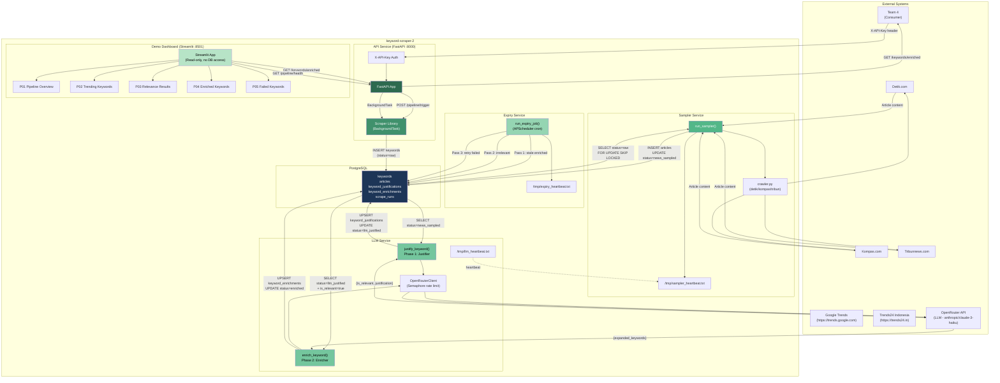

---

## 2. Keyword Lifecycle State Machine

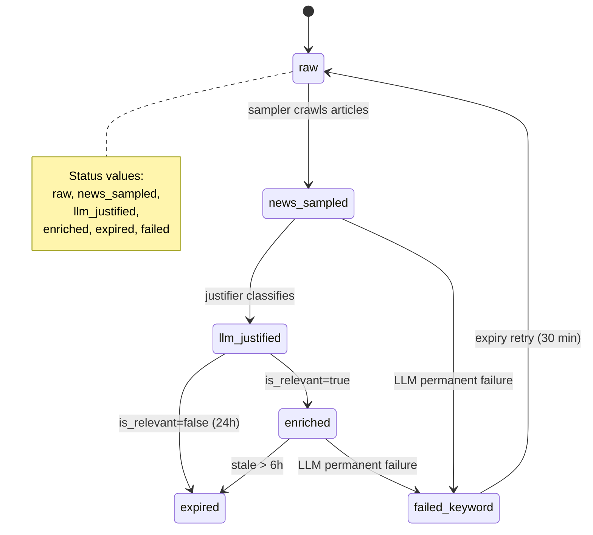

---

## 3. Database ER Diagram

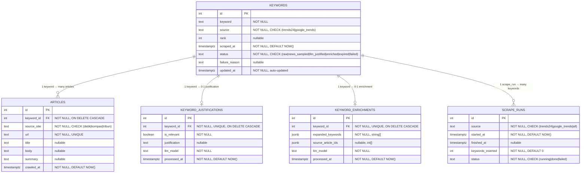

---

## 4. Polling Query Pattern (All Services)

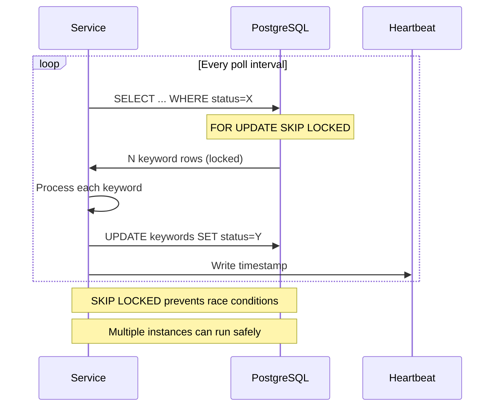

---

## 5. API Endpoint Flow

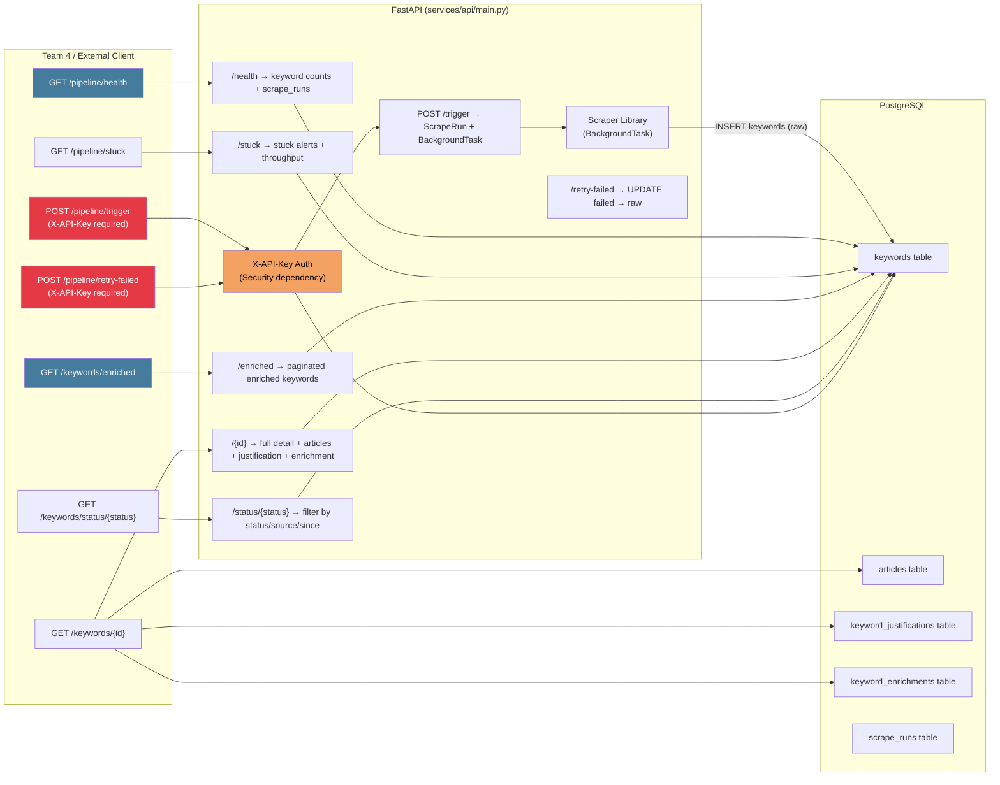

---

## 6. Sampler Data Flow

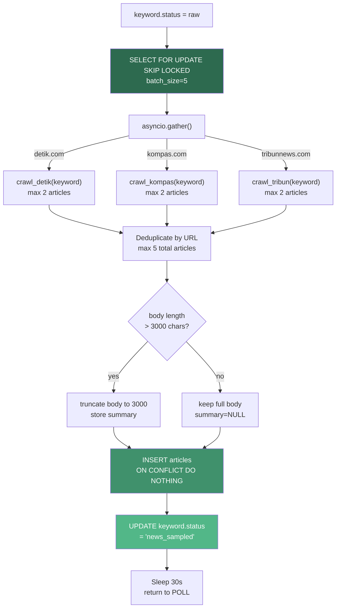

---

## 7. LLM Service — Justifier & Enricher Flow

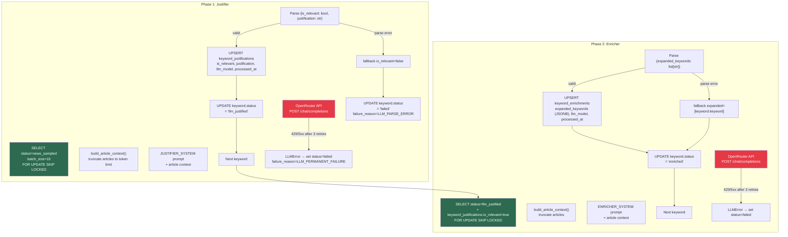

---

## 8. Expiry Service — Three Pass Flow

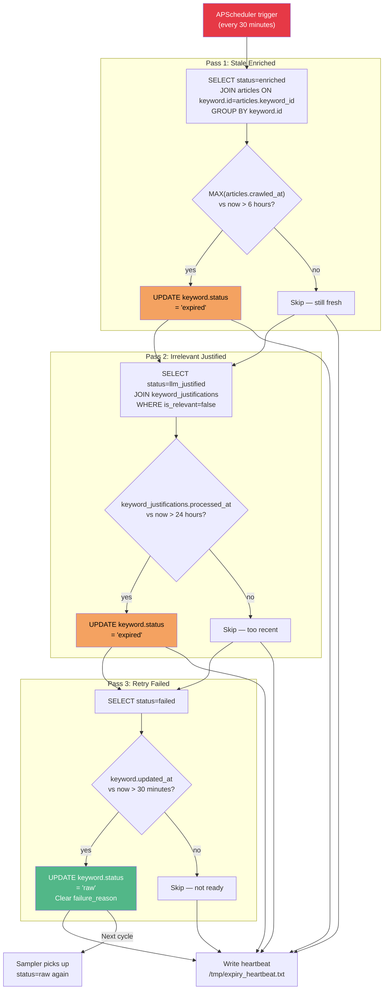

---

## 9. Scraper Delta Detection Flow

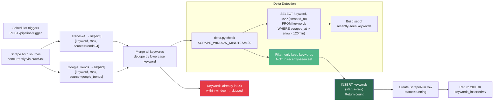

---

## 10. Streamlit Demo Dashboard Structure

```mermaid
graph TD
    ST["Streamlit App (:8501)\nservices/demo/app.py"]
    NAV["Sidebar Radio Buttons\n(5 navigation options)"]

    ST --> NAV

    NAV -->|"Option 1"| P01["P01 Pipeline Overview"]
    NAV -->|"Option 2"| P02["P02 Trending Keywords"]
    NAV -->|"Option 3"| P03["P03 Relevance Results"]
    NAV -->|"Option 4"| P04["P04 Enriched Keywords"]
    NAV -->|"Option 5"| P05["P05 Failed Keywords"]

    subgraph "Shared Components"
        API["_api.py\nhttpx client → FastAPI"]
        MODELS["_models.py\nDataclass response models"]
        THEME["_theme.py\nDark theme CSS injection"]
        CMPS["components/\n_metric_card, _status_badge\n_freshness_indicator, _detail_expander"]
    end

    P01 --> API
    P02 --> API
    P03 --> API
    P04 --> API
    P05 --> API

    P01 --> MODELS
    P02 --> MODELS
    P03 --> MODELS
    P04 --> MODELS
    P05 --> MODELS

    P01 --> CMPS
    P02 --> CMPS
    P03 --> CMPS
    P04 --> CMPS
    P05 --> CMPS

    API -->|"GET /pipeline/health"| FP["FastAPI (:8000)"]
    API -->|"GET /keywords/enriched"| FP
    API -->|"GET /keywords/status/{status}"| FP

    subgraph "P01 Metrics"
        M1["Total keywords by status"]
        M2["Last scrape run info"]
        M3["Stuck keyword alerts"]
        M4["Throughput KPIs"]
        M5["Status distribution bar chart"]
    end
    P01 --> M1 & M2 & M3 & M4 & M5

    subgraph "P02 Filters"
        F2["Source filter\n(trends24 / google_trends)"]
        F3["Time range filter\n(since timestamp)"]
    end
    P02 --> F2 & F3

    subgraph "P03 Color Coding"
        C3["is_relevant=true → green"]
        C4["is_relevant=false → red/orange"]
    end
    P03 --> C3 & C4

    subgraph "P04 Chips"
        C4["expanded_keywords\ndisplayed as chips/tags"]
    end
    P04 --> C4

    subgraph "P05 Details"
        F5["failure_reason displayed\nfor each failed keyword"]
    end
    P05 --> F5

    style ST fill:#1d3557,color:#fff
    style API fill:#2d6a4f,color:#fff
    style FP fill:#457b9d,color:#fff
```

---

## 11. Complete Data Flow (Full Pipeline)

```mermaid
flowchart LR
    subgraph "Trigger"
        SCH["Team 4 Scheduler\nor Manual trigger"]
    end

    subgraph "1. Scrape"
        TRIGGER["POST /pipeline/trigger"]
        SCR["Scraper BackgroundTask"]
        T24["Trends24"]
        GT["Google Trends"]
        DELTA["delta.py filter"]
        KW_RAW["keywords: raw"]
    end

    subgraph "2. Sample"
        SM["Sampler Service\npoll: status=raw"]
        DK["Detik"]
        KP["Kompas"]
        TB["Tribun"]
        ART["articles"]
        KW_SAMPLED["keywords: news_sampled"]
    end

    subgraph "3. Justify (LLM)"
        JUST["LLM Justifier\npoll: status=news_sampled"]
        OR1["OpenRouter\n{is_relevant, justification}"]
        JUSTIF["keyword_justifications"]
        KW_JUST["keywords: llm_justified"]
    end

    subgraph "4. Enrich (LLM)"
        ENRICH["LLM Enricher\npoll: llm_justified\n+ is_relevant=true"]
        OR2["OpenRouter\n{expanded_keywords}"]
        ENRCH["keyword_enrichments"]
        KW_ENR["keywords: enriched"]
    end

    subgraph "5. Expire (Cron)"
        EXP["Expiry Service\nevery 30 min"]
        E1["Pass 1: stale enriched"]
        E2["Pass 2: irrelevant"]
        E3["Pass 3: retry failed"]
        KW_EXP["keywords: expired\nor back to raw"]
    end

    subgraph "6. Consume"
        API_ENRICH["GET /keywords/enriched"]
        T4["Team 4 API Consumer"]
    end

    SCH --> TRIGGER --> SCR
    SCR --> T24
    SCR --> GT
    GT --> DELTA
    T24 --> DELTA
    DELTA --> KW_RAW
    KW_RAW --> SM
    SM --> DK & KP & TB
    DK & KP & TB --> ART
    ART --> KW_SAMPLED
    KW_SAMPLED --> JUST
    JUST --> OR1
    OR1 --> JUSTIF
    JUSTIF --> KW_JUST
    KW_JUST --> ENRICH
    ENRICH --> OR2
    OR2 --> ENRCH
    ENRCH --> KW_ENR
    KW_ENR --> EXP
    EXP --> E1 & E2 & E3
    E1 & E2 & E3 --> KW_EXP
    KW_ENR --> API_ENRICH
    API_ENRICH --> T4

    style SCH fill:#e63946,color:#fff
    style T4 fill:#e63946,color:#fff
    style KW_RAW fill:#2d6a4f,color:#fff
    style KW_SAMPLED fill:#40916c,color:#fff
    style KW_JUST fill:#52b788,color:#fff
    style KW_ENR fill:#74c69d,color:#000
    style KW_EXP fill:#95d5b2,color:#000
```